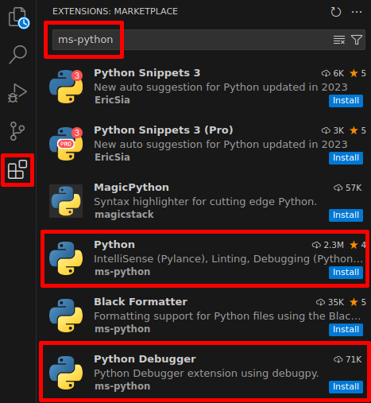
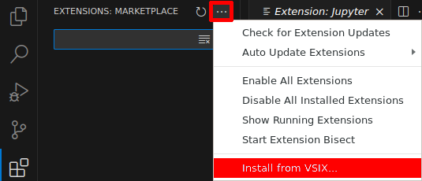
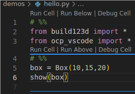

# Easterhegg 21 lasercut-with-build123d-workshop

Use exactly the _eh21-workshop_ branch from https://github.com/Windfisch/build123d!

## Setup

### Step 1: preparation
`git clone` this repo and install Visual Studio Code.

Then create and activate a fresh python venv

```sh
python -m venv eh21-b3d-venv
source eh21-b3d-venv/bin/activate
```

(Note: do the `source` line in every terminal you open!)

### Step 2: python and jupyter
Run `code --enable-proposed-api ms-toolsai.jupyter --enable-proposed-api ms-python` and
install the "Python" and "Python Debugger" extensions from "ms-python", and the
"Jupyter" extension from "ms-toolsai".



Choose "File -> Open folder" and open the "eh21-b3d-workshop" directory. (This is where you
cloned this repo to.)

### Step 3: build123d and ocp-cad-viewer

Install [ocp-cad-viewer-2.1.1.vsix](https://github.com/bernhard-42/vscode-ocp-cad-viewer/releases/download/v2.1.1/ocp-cad-viewer-2.1.1.vsix).



Click on the OCP logo  in the left sidebar and choose "Quickstart build123d".

Then (afterwards!), install the patched build123d version:

```sh
source eh21-b3d-venv/bin/activate # don't forget if you opened a new terminal
pip install git+https://github.com/Windfisch/build123d@eh21-workshop
```

## Hello World

In VsCode, create a new python script and type:

```sh
# %%
from build123d import *
from ocp_vscode import *
# %%
box = Box(10,15,20)
show(box)
```

You should see this:



Try both "Run cell"s. You should see a box in the right pane.
Try the grey "play" button on the top left, the same should happen.

Troubleshooting:

- no "run cell"? Install Jupyter extension, or check `--enable-proposed-api` argument.
- import errors? Have you done "Quickstart build123d" (and afterwards, `pip install ...`)?
- no box appears? Is the OCP-vscode extension running? Check the `--enable-proposed-api` argument.

_Did everything work? You're ready for the workshop!_

_Any problems? Take your question to the workshop!_
